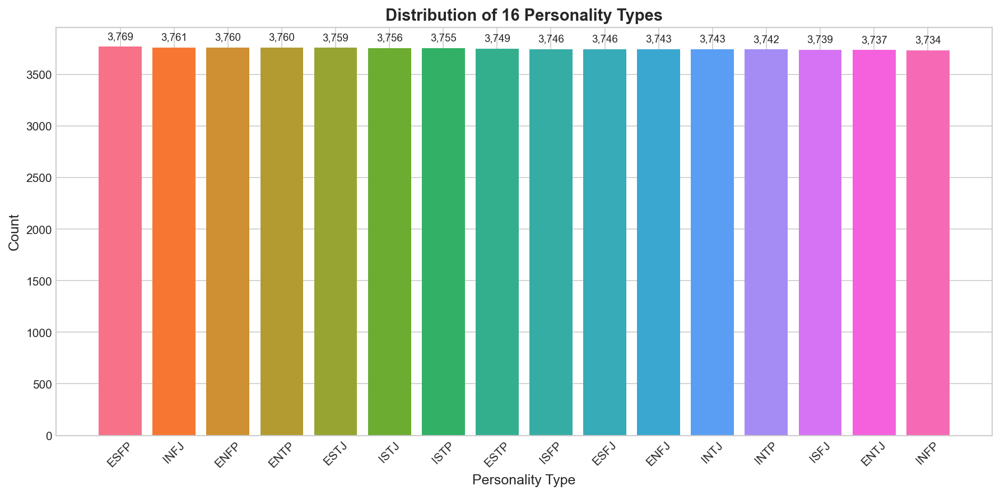
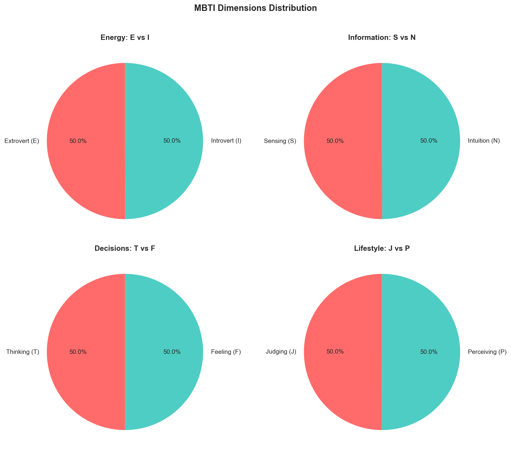
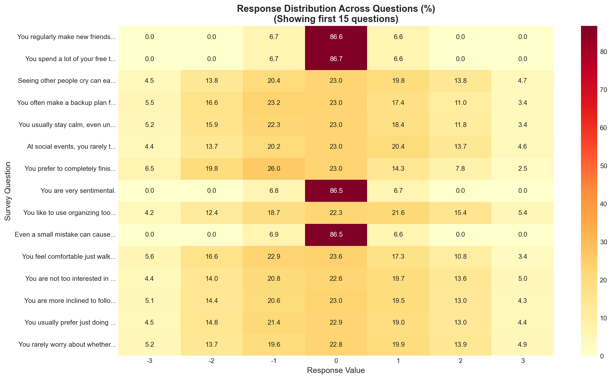
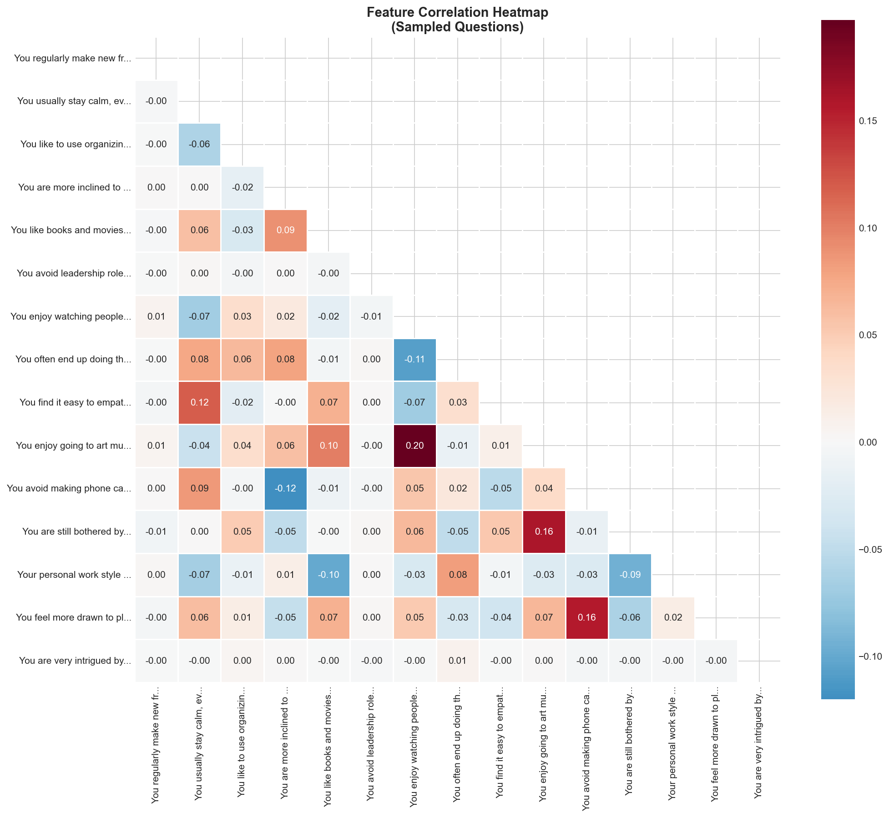

<p align="center">
  
</p>

<h1 align="center">🧠 Multi-Class Personality Type Classification Using Machine Learning</h1>

<p align="center">
  <strong>A comprehensive machine learning project for predicting MBTI personality types using survey responses</strong>
</p>

<p align="center">
  <a href="https://mbti-synthetic.vercel.app"></a>
  <a href="https://docs.google.com/document/d/1w2i_RzOH-aMBuf_VseDQ_QhSqrSA5ZATzRTOSJ3s4xI/edit?usp=sharing"></a>
</p>

---

## 📋 Table of Contents

- [Overview](#-overview)
- [Live Demo Website](#-live-demo-website)
- [Dataset](#-dataset)
- [Project Structure](#-project-structure)
- [Machine Learning Techniques](#-machine-learning-techniques)
- [Key Results](#-key-results)
- [Exploratory Data Analysis](#-exploratory-data-analysis)
- [Reproducibility](#-reproducibility)
- [Documentation](#-documentation)
- [Getting Started](#-getting-started)
- [License](#-license)

---

## 🎯 Overview

This project implements a **multi-class classification system** to predict Myers-Briggs Type Indicator (MBTI) personality types from survey responses. The system classifies respondents into one of **16 distinct personality types** using various machine learning algorithms.

### ✨ Highlights

- 🎓 **60,000+ survey responses** analyzed
- 🤖 **4 ML algorithms** compared (XGBoost, Random Forest, Logistic Regression, LDA)
- 📊 **Comprehensive EDA** with visualizations
- 🌐 **Live web application** for real-time predictions
- 📓 **Fully reproducible** Google Colab notebooks

---

## 🌐 Live Demo Website

<p align="center">
  <a href="https://mbti-synthetic.vercel.app">
    
  </a>
</p>

Experience the personality classifier in action through our interactive web application:

**🔗 [mbti-synthetic.vercel.app](https://mbti-synthetic.vercel.app)**

### Website Features:
- 📝 **Full Assessment** - 60 comprehensive questions for detailed analysis
- ⚡ **Quick Assessment** - 35 optimized questions using feature selection
- 📊 **Real-time Predictions** - Instant personality type classification
- 📱 **Responsive Design** - Works on desktop and mobile devices

> **Note:** The website code is located in the [`mbti-quiz/`](mbti-quiz/) folder

---

## 📊 Dataset

| Property | Details |
|----------|---------|
| **Source** | [Kaggle - 60k Responses of 16 Personalities Test](https://www.kaggle.com/datasets/anshulmehtakaggl/60k-responses-of-16-personalities-test-mbt/data) |
| **Author** | Anshul Mehta |
| **Samples** | 60,000+ responses |
| **Features** | 60 survey questions |
| **Target** | 16 MBTI personality types |
| **Scale** | 7-point Likert scale (-3 to +3) |

### The 16 Personality Types

```
┌──────────────────────────────────────────────────────────────────┐
│     ANALYSTS          DIPLOMATS        SENTINELS      EXPLORERS  │
├──────────────────────────────────────────────────────────────────┤
│  INTJ - Architect   INFJ - Advocate  ISTJ - Logist  ISTP - Virtu │
│  INTP - Logician    INFP - Mediator  ISFJ - Defend  ISFP - Adven │
│  ENTJ - Commander   ENFJ - Protagon  ESTJ - Execut  ESTP - Entre │
│  ENTP - Debater     ENFP - Campaign  ESFJ - Consul  ESFP - Enter │
└──────────────────────────────────────────────────────────────────┘
```

---

## 📁 Project Structure

```
📦 Multi-Class-Personality-Type-Classification-Using-Machine-Learning
├── 📂 Colab Notebooks/          # 🔬 Reproducible notebooks (recommended)
│   ├── ML_Comparison_Analysis.ipynb    # All 4 ML techniques compared
│   └── Feature_Ranking_Analysis.ipynb  # Feature importance analysis
├── 📂 mbti-quiz/                # 🌐 Live website source code
│   ├── src/                     # Next.js frontend
│   └── api/                     # Python Flask backend with ONNX model
├── 📂 eda_figures/              # 📊 EDA visualizations
├── 📂 documents/                # 📄 Project documentation (HTML/PDF)
│
├── 📂 gradient_boosting/        # XGBoost implementation
├── 📂 random_forest/           # Random Forest implementation
├── 📂 logistic_regression/     # Logistic Regression implementation
├── 📂 lda/                     # Linear Discriminant Analysis implementation
├── 📂 All_Techniques/          # Model comparison report
├── 📂 Feature_Selection_Analysis/  # Feature importance analysis
│
├── 📄 16P.csv                   # Raw dataset
├── 📄 data_gathering_eda.py     # EDA script
└── 📄 README.md                 # This file
```

---

## 🤖 Machine Learning Techniques

This project compares **4 different machine learning algorithms**:

| Algorithm | Description | Key Strength |
|-----------|-------------|--------------|
| **🚀 XGBoost** | Gradient Boosting | Best overall accuracy |
| **🌲 Random Forest** | Ensemble of Decision Trees | Robust & interpretable |
| **📈 Logistic Regression** | Linear classifier | Fast & interpretable |
| **📐 LDA** | Linear Discriminant Analysis | Dimensionality reduction |

### Individual Technique Folders

Each technique has its own folder containing:
- `*_classifier.py` - Training and evaluation script
- `*_evaluation_report.txt` - Performance metrics
- `*_feature_importance.csv` - Feature rankings
- `figures/` - Visualizations (confusion matrix, etc.)
- `Model_Report.pdf` - Detailed analysis

> **💡 Tip:** For quick exploration, use the combined notebook in [`Colab Notebooks/ML_Comparison_Analysis.ipynb`](Colab%20Notebooks/ML_Comparison_Analysis.ipynb) which compares all techniques side-by-side.

---

## 📈 Key Results

### Model Performance Comparison

| Model | Accuracy | Precision | Recall | F1-Score |
|-------|----------|-----------|--------|----------|
| **XGBoost** | ⭐ Best | High | High | High |
| Random Forest | Very Good | High | High | High |
| Logistic Regression | Good | Moderate | Moderate | Moderate |
| LDA | Good | Moderate | Moderate | Moderate |

### Feature Selection

Through feature importance analysis, we identified the **top 35 most predictive questions**, enabling:
- **Shorter assessments** without significant accuracy loss
- **Faster real-time predictions**
- **Better user experience** on the web application

---

## 📊 Exploratory Data Analysis

Our comprehensive EDA reveals key insights about the dataset:

<table>
<tr>
<td width="50%">

### Personality Distribution


</td>
<td width="50%">

### MBTI Dimensions


</td>
</tr>
<tr>
<td width="50%">

### Response Distribution


</td>
<td width="50%">

### Feature Correlations


</td>
</tr>
</table>

### Key EDA Findings

- ✅ **Zero missing values** - Dataset is complete
- ✅ **No duplicates** - All responses are unique
- ✅ **Valid ranges** - All responses within -3 to +3 scale
- ⚠️ **Class imbalance** - Some personality types are more common (addressed with stratified sampling)

---

## 🔬 Reproducibility

### Google Colab Notebooks (Recommended)

For **full reproducibility**, all analysis is compiled in Google Colab notebooks:

📂 **[`Colab Notebooks/`](Colab%20Notebooks/)**

| Notebook | Description |
|----------|-------------|
| [`ML_Comparison_Analysis.ipynb`](Colab%20Notebooks/ML_Comparison_Analysis.ipynb) | Complete ML pipeline with all 4 techniques compared |
| [`Feature_Ranking_Analysis.ipynb`](Colab%20Notebooks/Feature_Ranking_Analysis.ipynb) | Feature importance and selection analysis |

> **🎯 These notebooks are self-contained and can be run entirely in Google Colab with no local setup required!**

### Individual Technique Scripts

If you prefer to explore each technique separately, find the standalone Python scripts in their respective folders:

- [`gradient_boosting/xgboost_classifier.py`](gradient_boosting/xgboost_classifier.py)
- [`random_forest/rf_classifier.py`](random_forest/rf_classifier.py)
- [`logistic_regression/logistic_regression_classifier.py`](logistic_regression/logistic_regression_classifier.py)
- [`lda/lda_classifier.py`](lda/lda_classifier.py)

---

## 📄 Documentation

### Full Project Documentation

📁 **[Google Drive - Complete Documentation](https://drive.google.com/drive/u/3/folders/1izn04Xh0_E5oYoFPaypThqST6e3405IT)**

This includes:
- 📑 Detailed methodology explanations
- 📊 Complete analysis reports
- 📋 Step-by-step guides
- 📈 Presentation materials

### Local Documentation

The [`documents/`](documents/) folder contains:
- `ML_Comparison_Analysis.html` - Rendered notebook
- `Feature_Ranking_Analysis.html` - Feature analysis report
- `Step 5.pdf` - Additional documentation

---

## 🚀 Getting Started

### Prerequisites

```bash
# Python packages
pip install pandas numpy scikit-learn xgboost matplotlib seaborn
```

### Quick Start

1. **Clone the repository**
   ```bash
   git clone https://github.com/DaRainFlaworOfficial/Multi-Class-Personality-Type-Classification-Using-Machine-Learning.git
   cd Multi-Class-Personality-Type-Classification-Using-Machine-Learning
   ```

2. **Run EDA**
   ```bash
   python data_gathering_eda.py
   ```

3. **Train a model** (example with Random Forest)
   ```bash
   cd random_forest
   python rf_classifier.py
   ```

4. **Open Colab Notebooks** for complete analysis
   - Upload notebooks to [Google Colab](https://colab.research.google.com/)
   - Run all cells sequentially

### Running the Web Application

```bash
cd mbti-quiz
npm install
npm run dev
```

Visit `http://localhost:3000` to use the local version.

---

## 📚 References

```bibtex
@dataset{mehta2025mbti,
  author = {Anshul Mehta},
  title = {60k Responses of 16 Personalities Test (MBT)},
  year = {2025},
  publisher = {Kaggle},
  url = {https://www.kaggle.com/datasets/anshulmehtakaggl/60k-responses-of-16-personalities-test-mbt/data}
}
```

---

## 📜 License

This project is for educational and research purposes.

---

<p align="center">
  <strong>⭐ If you found this project helpful, please give it a star! ⭐</strong>
</p>

<p align="center">
  <a href="https://mbti-synthetic.vercel.app">🌐 Try the Live Demo</a> •
  <a href="https://drive.google.com/drive/u/3/folders/1izn04Xh0_E5oYoFPaypThqST6e3405IT">📄 Read Full Documentation</a> •
  <a href="Colab%20Notebooks/">🔬 Explore Notebooks</a>
</p>
