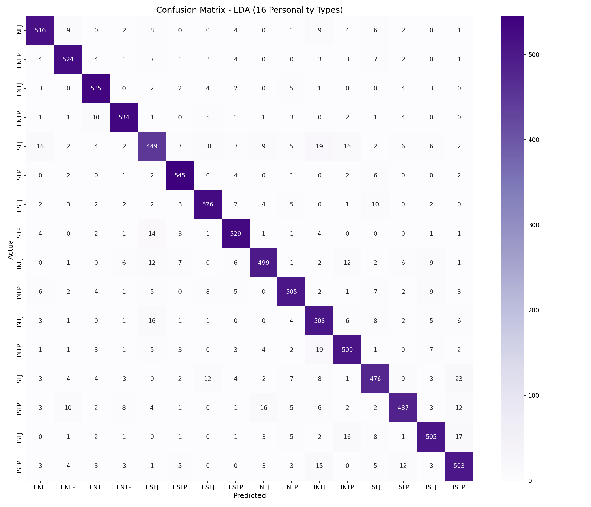
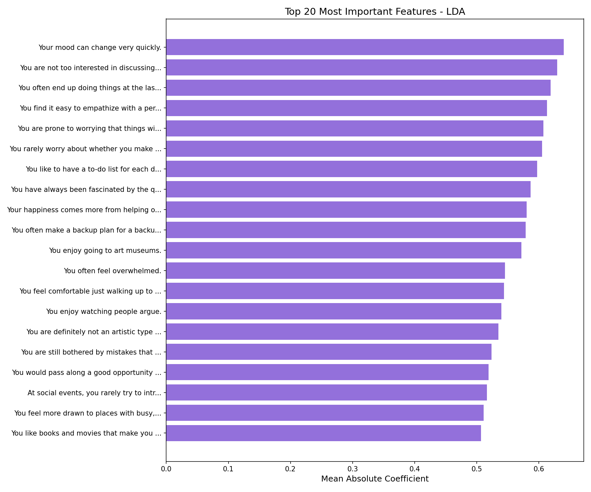
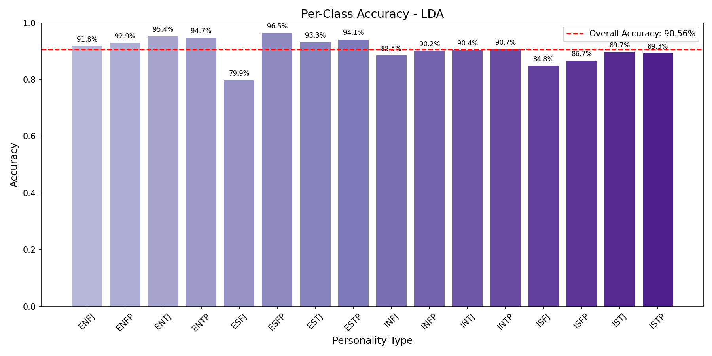

# Linear Discriminant Analysis (LDA) Classifier Report
**Project:** Multi-Class Classification of Personality Types (MBTI)  
**Date:** 2026-01-31  

---

## 1. Executive Summary
The **Linear Discriminant Analysis (LDA) Classifier** was trained to predict 16 MBTI personality types based on 60 survey questions. LDA is a dimensionality reduction technique that also performs classification by finding linear combinations of features that best separate classes.

## 2. Model Configuration

### Data Split
- **Training:** 70% (42,023 samples)
- **Validation:** 15% (8,976 samples)
- **Test:** 15% (9,000 samples)
*Stratified split ensures equal representation of all 16 personality types.*
*Uses SAME data splits as Gradient Boosting and Logistic Regression for fair comparison.*

### Hyperparameters
- **Algorithm:** Linear Discriminant Analysis
- **Solver:** SVD (Singular Value Decomposition)
- **Feature Scaling:** StandardScaler (zero mean, unit variance)
- **Number of Discriminant Components:** 15 (min of n_classes-1 and n_features)

## 3. Performance Metrics

| Measure | Score | Notes |
|---------|-------|-------|
| **Test Accuracy** | **90.56%** | Overall classification accuracy |
| **Validation Accuracy** | **90.63%** | Validation set performance |
| **Train Accuracy** | **90.53%** | Training set performance |
| **Top-2 Accuracy** | **96.44%** | Correct type in top 2 predictions |
| **Top-3 Accuracy** | **98.14%** | Correct type in top 3 predictions |
| **Top-5 Accuracy** | **99.01%** | Correct type in top 5 predictions |
| **Macro F1-Score** | **0.9053** | Balanced across all 16 classes |
| **Macro Precision** | **0.9055** | Average precision across classes |
| **Macro Recall** | **0.9055** | Average recall across classes |

### Overfitting Analysis
**Train-Test Gap: -0.03%** — Excellent! Model generalizes very well with virtually no overfitting. The validation accuracy is actually slightly higher than training accuracy, indicating robust performance.

## 4. Visualizations

### 4.1 Confusion Matrix
The confusion matrix shows the alignment between Actual and Predicted personality types.

### 4.2 Feature Importance
The top 20 most influential survey questions based on mean absolute LDA coefficient values.

### 4.3 Per-Class Accuracy
Accuracy breakdown for each of the 16 personality types.

## 5. Per-Class Performance

| Personality | Precision | Recall | F1-Score | Support |
|------------|-----------|--------|----------|----------|
| **ENFJ** | 0.9133 | 0.9181 | 0.9157 | 562 |
| **ENFP** | 0.9274 | 0.9291 | 0.9283 | 564 |
| **ENTJ** | 0.9304 | 0.9537 | 0.9419 | 561 |
| **ENTP** | 0.9418 | 0.9468 | 0.9443 | 564 |
| **ESFJ** | 0.8504 | 0.7989 | 0.8239 | 562 |
| **ESFP** | 0.9380 | 0.9646 | 0.9511 | 565 |
| **ESTJ** | 0.9228 | 0.9326 | 0.9277 | 564 |
| **ESTP** | 0.9232 | 0.9413 | 0.9322 | 562 |
| **INFJ** | 0.9207 | 0.8848 | 0.9024 | 564 |
| **INFP** | 0.9132 | 0.9018 | 0.9075 | 560 |
| **INTJ** | 0.8495 | 0.9039 | 0.8759 | 562 |
| **INTP** | 0.8852 | 0.9073 | 0.8961 | 561 |
| **ISFJ** | 0.8799 | 0.8485 | 0.8639 | 561 |
| **ISFP** | 0.9069 | 0.8665 | 0.8863 | 562 |
| **ISTJ** | 0.9083 | 0.8970 | 0.9026 | 563 |
| **ISTP** | 0.8763 | 0.8934 | 0.8848 | 563 |

**Notable Observations:**
- Best performing types: **ENTP** (F1: 0.9443), **ESFP** (F1: 0.9511), **ENTJ** (F1: 0.9419)
- Most challenging types: **ESFJ** (F1: 0.8239), **ISFJ** (F1: 0.8639)
- All personality types achieve F1-scores above 0.82, showing strong balanced performance

## 6. Top 10 Most Important Features

Based on mean absolute LDA coefficient magnitude:

1. **[0.6400]** Your mood can change very quickly.
2. **[0.6293]** You are not too interested in discussing various interpretations and analyses of creative works.
3. **[0.6187]** You often end up doing things at the last possible moment.
4. **[0.6132]** You find it easy to empathize with a person whose experiences are very different from yours.
5. **[0.6072]** You are prone to worrying that things will take a turn for the worse.
6. **[0.6049]** You rarely worry about whether you make a good impression on people you meet.
7. **[0.5970]** You like to have a to-do list for each day.
8. **[0.5865]** You have always been fascinated by the question of what, if anything, happens after death.
9. **[0.5806]** Your happiness comes more from helping others accomplish things than your own accomplishments.
10. **[0.5789]** You often make a backup plan for a backup plan.

## 7. Conclusion

LDA is a classical linear classifier that also provides dimensionality reduction, making it interpretable and efficient for multi-class classification tasks.

### Key Takeaways:
- ✅ Uses same data splits as other models for fair comparison
- ✅ Provides interpretable linear decision boundaries
- ✅ Efficient computation via SVD solver
- 📊 No hyperparameter tuning required (simple model)

---
*Report generated from model training results. Random state: 42 for reproducibility.*
