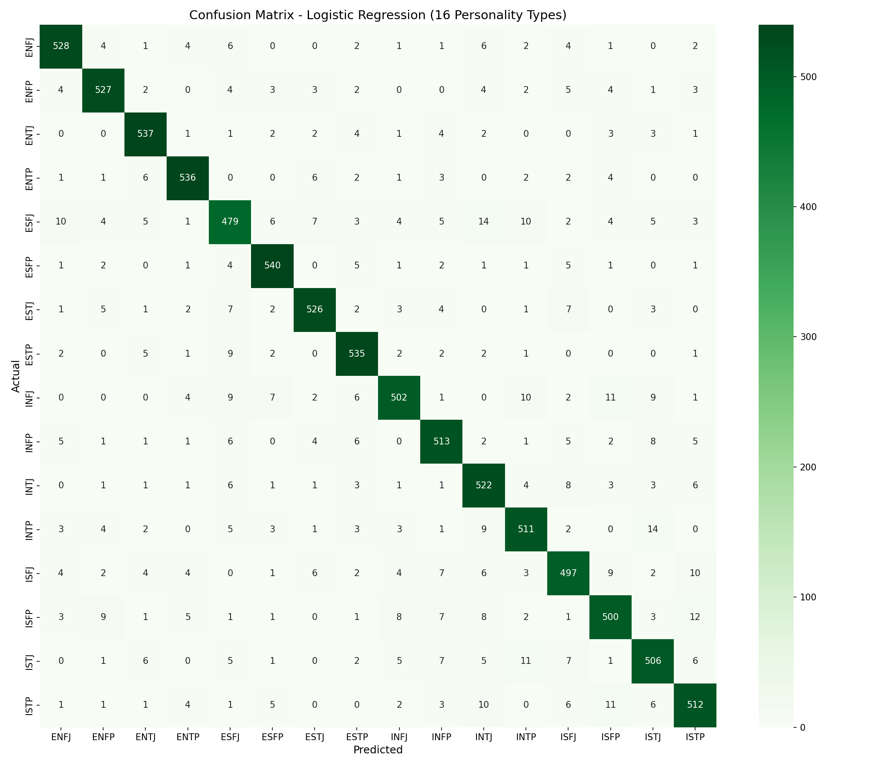
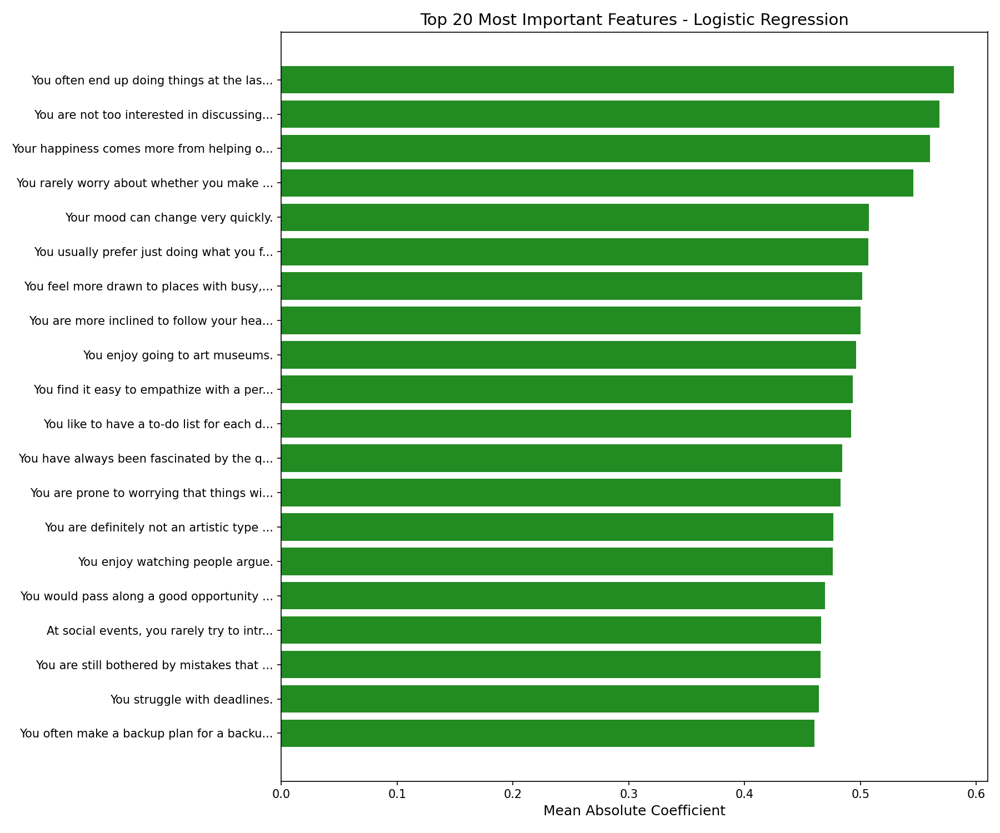
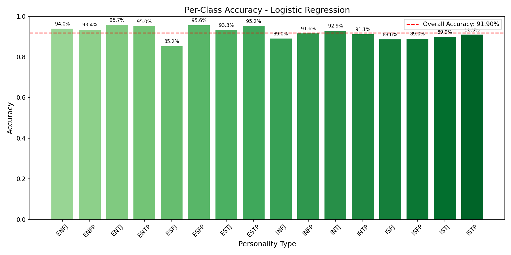

# Logistic Regression Classifier Report
**Project:** Multi-Class Classification of Personality Types (MBTI)  
**Date:** 2026-01-31  

---

## 1. Executive Summary
The **Logistic Regression Classifier** (Multinomial/Softmax) was trained to predict 16 MBTI personality types based on 60 survey questions.

## 2. Model Configuration

### Data Split
- **Training:** 70% (42,023 samples)
- **Validation:** 15% (8,976 samples)
- **Test:** 15% (9,000 samples)
*Stratified split ensures equal representation of all 16 personality types.*

### Hyperparameters
- **Algorithm:** Logistic Regression (Multinomial)
- **Solver:** L-BFGS
- **Regularization (C):** 1.0
- **Max Iterations:** 1000
- **Feature Scaling:** StandardScaler (zero mean, unit variance)
- **Iterations to Converge:** 24

## 3. Performance Metrics

| Measure | Score | Notes |
|---------|-------|-------|
| **Test Accuracy** | 91.90% | Overall classification accuracy |
| **Validation Accuracy** | 92.12% | Validation set performance |
| **Train Accuracy** | 92.35% | Training set performance |
| **Top-2 Accuracy** | 97.31% | Correct type in top 2 predictions |
| **Top-3 Accuracy** | 98.62% | Correct type in top 3 predictions |
| **Top-5 Accuracy** | 99.27% | Correct type in top 5 predictions |
| **Macro F1-Score** | 0.9189 | Balanced across all 16 classes |
| **Macro Precision** | 0.9190 | Average precision across classes |
| **Macro Recall** | 0.9190 | Average recall across classes |

### Overfitting Analysis
Train-Test Gap: **0.45%** — Model generalizes well with minimal overfitting.

## 4. Visualizations

### 4.1 Confusion Matrix
The confusion matrix shows the alignment between Actual and Predicted personality types.

### 4.2 Feature Importance
The top 20 most influential survey questions based on mean absolute coefficient values.

### 4.3 Per-Class Accuracy
Accuracy breakdown for each of the 16 personality types.

## 5. Per-Class Performance (Top 5 & Bottom 5)

### Best Performing Classes
| Type | Precision | Recall | F1-Score |
|------|-----------|--------|----------|
| ENTP | 0.9487 | 0.9504 | 0.9495 |
| ESFP | 0.9408 | 0.9558 | 0.9482 |
| ENTJ | 0.9372 | 0.9572 | 0.9471 |
| ENFJ | 0.9378 | 0.9395 | 0.9387 |
| ESTP | 0.9256 | 0.9520 | 0.9386 |

### Lowest Performing Classes
| Type | Precision | Recall | F1-Score |
|------|-----------|--------|----------|
| ESFJ | 0.8821 | 0.8523 | 0.8670 |
| ISFJ | 0.8987 | 0.8859 | 0.8923 |
| ISFP | 0.9025 | 0.8897 | 0.8961 |
| ISTJ | 0.8988 | 0.8988 | 0.8988 |
| INTJ | 0.8832 | 0.9288 | 0.9055 |

## 6. Top 10 Most Important Features

| Rank | Coefficient | Survey Question |
|------|-------------|-----------------|
| 1 | 0.5807 | You often end up doing things at the last possible moment. |
| 2 | 0.5680 | You are not too interested in discussing various interpretations and analyses of creative works. |
| 3 | 0.5601 | Your happiness comes more from helping others accomplish things than your own accomplishments. |
| 4 | 0.5459 | You rarely worry about whether you make a good impression on people you meet. |
| 5 | 0.5072 | Your mood can change very quickly. |
| 6 | 0.5068 | You usually prefer just doing what you feel like at any given moment instead of planning a particular daily routine. |
| 7 | 0.5014 | You feel more drawn to places with busy, bustling atmospheres than quiet, intimate places. |
| 8 | 0.5002 | You are more inclined to follow your head than your heart. |
| 9 | 0.4961 | You enjoy going to art museums. |
| 10 | 0.4931 | You find it easy to empathize with a person whose experiences are very different from yours. |

## 7. Conclusion

Logistic Regression achieves **91.90% test accuracy** on the 16-class MBTI personality prediction task. Its coefficient-based feature importance provides clear, interpretable insights into which survey questions are most predictive of personality types.

### Key Takeaways:
- ✅ Strong generalization (train-test gap only 0.45%)
- ✅ High top-k accuracy (98.62% for top-3)
- ✅ Interpretable coefficients for feature analysis
- ⚠️ Some personality types (ESFJ, ISFJ) are harder to distinguish
- 📊 Clear advantage: model simplicity and interpretability

---
*Report generated from model training results. Random state: 42 for reproducibility.*
