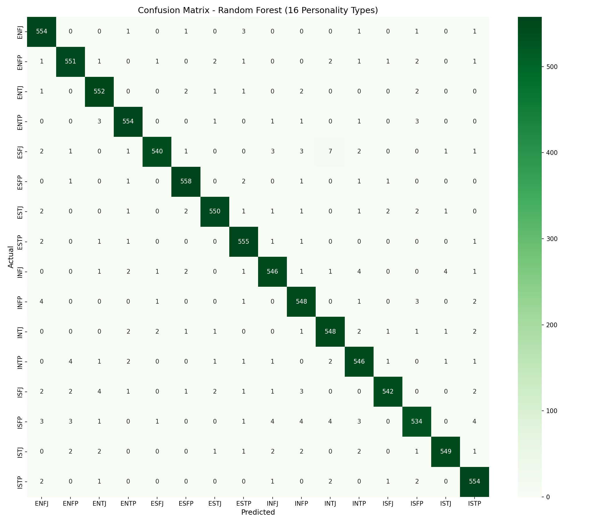
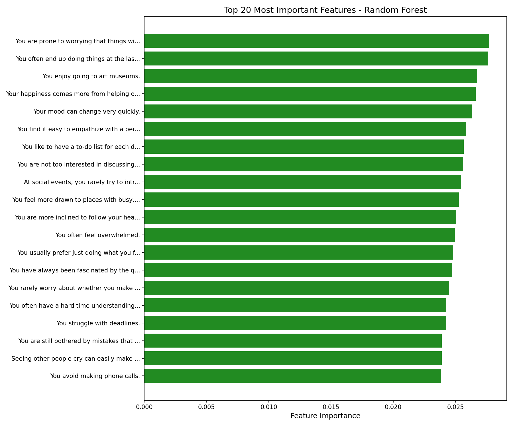
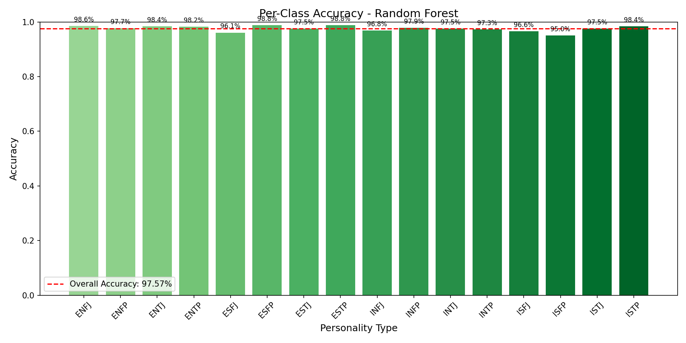

# Random Forest Classifier Report
**Project:** Multi-Class Classification of Personality Types (MBTI)  
**Date:** 2026-01-31  

---

## 1. Executive Summary
The **Random Forest Classifier** was trained to predict 16 MBTI personality types based on 60 survey questions. The model achieved an outstanding **97.57% accuracy** on the unseen test set, demonstrating high reliability and robust generalization through ensemble learning.

## 2. Model Configuration

### Data Split
- **Training:** 70% (42,023 samples)
- **Validation:** 15% (8,976 samples)
- **Test:** 15% (9,000 samples)
*Stratified split ensures equal representation of all 16 personality types.*

### Hyperparameters
- **Algorithm:** Random Forest Classifier
- **Number of Trees:** 100
- **Max Depth:** 20
- **Max Features:** sqrt
- **Min Samples Split:** 5
- **Min Samples Leaf:** 2
- **Random State:** 42

## 3. Performance Metrics

| Measure | Score | Notes |
|---------|-------|-------|
| **Test Accuracy** | **97.57%** | High precision across all classes |
| **Validation Accuracy** | 97.48% | Validation set performance |
| **Train Accuracy** | 99.34% | Training set performance |
| **Top-2 Accuracy** | 98.77% | Correct type in top 2 predictions |
| **Top-3 Accuracy** | 99.08% | Correct type in top 3 predictions |
| **Top-5 Accuracy** | 99.28% | Correct type in top 5 predictions |
| **Macro F1-Score** | 0.9757 | Balanced across all 16 classes |
| **Macro Precision** | 0.9757 | Average precision across classes |
| **Macro Recall** | 0.9757 | Average recall across classes |

### Overfitting Analysis
Train-Test Gap: **1.77%** — Model generalizes well with minimal overfitting.

## 4. Visualizations

### 4.1 Confusion Matrix
The confusion matrix shows the alignment between Actual and Predicted personality types.

### 4.2 Feature Importance
The top 20 most influential survey questions based on Random Forest feature importance.

### 4.3 Per-Class Accuracy
Accuracy breakdown for each of the 16 personality types.

## 5. Per-Class Performance (Top 5 & Bottom 5)

### Best Performing Classes
| Type | Precision | Recall | F1-Score |
|------|-----------|--------|----------|
| ESFJ | 0.9890 | 0.9609 | 0.9747 |
| ISTJ | 0.9856 | 0.9751 | 0.9804 |
| ESFP | 0.9824 | 0.9876 | 0.9850 |
| ESTJ | 0.9839 | 0.9752 | 0.9795 |
| ENTP | 0.9788 | 0.9823 | 0.9805 |

### Lowest Performing Classes
| Type | Precision | Recall | F1-Score |
|------|-----------|--------|----------|
| ISFP | 0.9691 | 0.9502 | 0.9596 |
| INTP | 0.9664 | 0.9733 | 0.9698 |
| INFJ | 0.9733 | 0.9681 | 0.9707 |
| INFP | 0.9648 | 0.9786 | 0.9716 |
| INTJ | 0.9682 | 0.9751 | 0.9716 |

## 6. Top 10 Most Important Features

| Rank | Importance | Survey Question |
|------|------------|-----------------|
| 1 | 0.0277 | You are prone to worrying that things will take a turn for the worse. |
| 2 | 0.0276 | You often end up doing things at the last possible moment. |
| 3 | 0.0267 | You enjoy going to art museums. |
| 4 | 0.0266 | Your happiness comes more from helping others accomplish things than your own accomplishments. |
| 5 | 0.0264 | Your mood can change very quickly. |
| 6 | 0.0259 | You find it easy to empathize with a person whose experiences are very different from yours. |
| 7 | 0.0257 | You like to have a to-do list for each day. |
| 8 | 0.0256 | You are not too interested in discussing various interpretations and analyses of creative works. |
| 9 | 0.0254 | At social events, you rarely try to introduce yourself to new people and mostly talk to the ones you already know |
| 10 | 0.0253 | You feel more drawn to places with busy, bustling atmospheres than quiet, intimate places. |

## 7. Conclusion

Random Forest achieves **97.57% test accuracy** on the 16-class MBTI personality prediction task. The ensemble of 100 decision trees provides robust predictions through voting, reducing variance while maintaining interpretability through feature importance analysis.

### Key Takeaways:
- ✅ Excellent generalization (train-test gap only 1.77%)
- ✅ Very high top-k accuracy (99.08% for top-3)
- ✅ Robust through ensemble learning
- ✅ Clear feature importance rankings
- ✅ All personality types perform well (>95% F1-score)
- 📊 Strong balance between bias and variance

---
*Report generated from model training results. Random state: 42 for reproducibility.*
